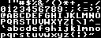

Some 8x8 fonts that can be used with the bitmap module.

Raster Fonts
============

`bmp.h` has support for drawing text using raster fonts from any of the 
supported file types.

The characters in the bitmap must be arranged like this:
```
 !"#$%&'()*+,-./
0123456789:;<=>?
@ABCDEFGHIJKLMNO
PQRSTUVWXYZ[\]^_
`abcdefghijklmno
pqrstuvwxyz{|}~ 
```

The characters are in ASCII sequence, without the first 32 control characters. 
The pixel width and hight of the individual characters is calculated by dividing
the width and height of the bitmap by 16 and 6 respectively.

`font.gif` is an example of an 8x8 font that can be used in this way:



The image is 128x48 pixels, so the individual characters are 8x8 pixels.
(128/16=8 and 48/6=8)
 
Usage:

    /* Create a */
    BmFont *font = bm_make_ras_font("font.gif", 7);
    if(!font) {
        fprintf(stderr, "error: %s\n", "font.gif");
        return 1;
    }
    
    /* Then set the font on your Bitmap object */
    bm_set_font(b, font);
    
    /* You can now use the font: */
    bm_puts(b, 30, 60, "Hello World");
    
    /* Then free the font when you're done with it */
    bm_font_release(font);

XBM Fonts
=========

The XBM fonts in this directory can be compiled directly into your executable,
so that you don't have to distribute any additonal files.

You create a `BmFont` object with the `bm_make_xbm_font()` function, then use
`bm_set_font()` to start using the font

The font XBM files were mostly inspired by the analysis of 8-bit computer fonts at
[Typography in 8 bits: System fonts](http://damieng.com/blog/2011/02/20/typography-in-8-bits-system-fonts). The
Apple ][ font turned out to be the nicest default font. The bold font was
inspired by Commodore 64. I later added some others for a bit of variety.

The `normal.xbm` file actually contains the default font available through the
`bm_reset_font()` function, but it is included here for completeness/if you
want to build a font off of it.

Usage:

    /* Include the XBM files in your project. */
    #include "fonts/bold.xbm"
    #include "fonts/circuit.xbm"
    #include "fonts/hand.xbm"
    #include "fonts/normal.xbm"
    #include "fonts/small.xbm"
    #include "fonts/smallinv.xbm"
    #include "fonts/thick.xbm"
    #include "fonts/thinsans.xbm"
    #include "fonts/infocom.xbm"
    
    /* Create the BmFont object from the XBM's bytes */
    BmFont *bfont_normal = bm_make_xbm_font(normal_bits, 6);
    BmFont *bfont_bold = bm_make_xbm_font(bold_bits, 8);
    BmFont *bfont_circuit = bm_make_xbm_font(circuit_bits, 7);
    BmFont *bfont_hand = bm_make_xbm_font(hand_bits, 7);
    BmFont *bfont_small = bm_make_xbm_font(small_bits, 5);
    BmFont *bfont_smallinv = bm_make_xbm_font(smallinv_bits, 7);
    BmFont *bfont_thick = bm_make_xbm_font(thick_bits, 6);
    BmFont *bfont_thinsans = bm_make_xbm_font(thinsans_bits, 6);
    BmFont *bfont_infocom = bm_make_xbm_font(infocom_bits, 6);
    
    /* Then set the font on your Bitmap object */
    bm_set_font(b, bfont_circuit);
    
    /* You can now use the font: */
    bm_puts(b, 30, 60, "Hello World");
    
    /* Then free the fonts when you're done with them */
    bm_font_release(bfont_normal);
    bm_font_release(bfont_bold);
    bm_font_release(bfont_circuit);
    bm_font_release(bfont_hand);
    bm_font_release(bfont_small);
    bm_font_release(bfont_smallinv);
    bm_font_release(bfont_thick);
    bm_font_release(bfont_thinsans);
    bm_font_release(bfont_infocom);

If you need to modify the fonts, the `dumpfonts` utility (in `dumpfonts.c`) will
dump all the fonts to GIF files, where they can be edited in a paint program.

To convert a file to an XBM font, use the `-X` option of the `bmfont` utility. 
For example:

    utils/bmfont -X newfont newfont.gif
